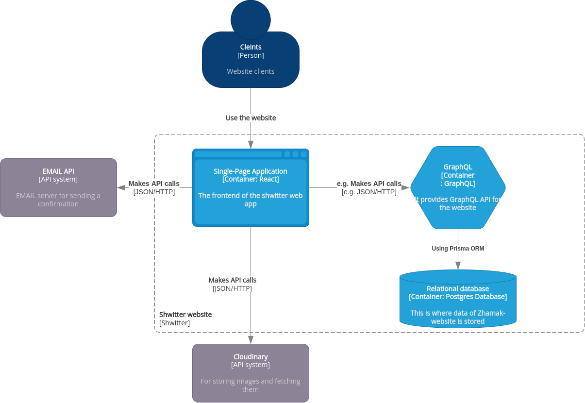

# Shwitter

Shwitter is a persian clone of twitter. This example shows how to implement a
simple micro-service architecture using modern stack.

Following is the [C4](https://c4model.com/) of the software architecture:

## Tech Stack

### Backend

- [**Apollo Server**](https://github.com/apollographql/apollo-server): HTTP server for GraphQL APIs
- [**GraphQL Nexus**](https://nexusjs.org/docs/): GraphQL schema definition and resolver implementation 
- [**Prisma Client**](https://www.prisma.io/docs/concepts/components/prisma-client): Databases access (ORM)                  
- [**Prisma Migrate**](https://www.prisma.io/docs/concepts/components/prisma-migrate): Database migrations               
- [**Postgres**](https://www.sqlite.org/index.html): SQL database

### Frontend

- [**React**](https://react.io): front-end JavaScript library for building user interfaces based on UI components
- [**React-Hook-Form**](https://react-hook-form.com/): Performant, flexible and extensible forms with easy-to-use validation
- [**Yup**](https://www.npmjs.com/package/Yup): Yup is a JavaScript schema builder for value parsing and validation
- [**TailwindCss**](https://tailwindcss.com/): A utility-first CSS framework

## Contents

- [Getting Started](#getting-started)
- [Project Showcase](#project-showcase)
- [Todo](#todo)
- [References](#refrences)
- [License](#license)

## Getting started

## Project showcase

## Todo
- [ ] Create CI/CD for the front and back
- [ ] Signup and Login page
- [ ] User can change their profile info
- [ ] Connection to cloudinary
- [ ] Users can shwit
- [ ] Unit test for Front
- [ ] Unit test for back

## References

## License
**This project is licensed under the terms of the MIT license.**
